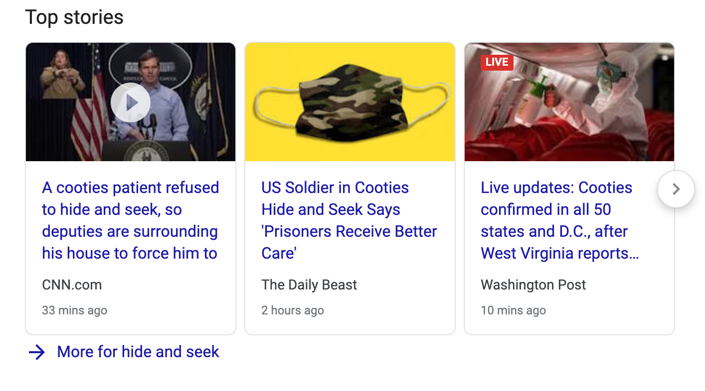

# Coronavirus to Cooties

Getting tired of the oversaturation, paranoina and fearmongering of the CoronaVirus media?

Chrome extension that replaces occurrences of the following words:

|  |  |
|-------------|---------|
| Coronavirus | Cooties |
| Covid-19 | SwineFlu-2.0 |
| Social Distancing | Tag, Not-It |
| Quarantine | Hide and Seek |
| The CDC | Your Mom |

And more...  

  

## Installation

Chrome no longer allows sideloading .crx files, and so I must pay and upload this to the chorome store (which I don't want to do).

You can pack and install this with just a few clicks. 

**There is a branch that is less politically correct called `boomer`. If you are not easily offended, I highly recomend you use it instead**

1. Navigate to [chrome://extensions/](chrome://extensions/)
2. Enable 'Developer Mode'
3. Click 'Pack Extension'
4. Choose 'Extension root directory' and navigate to the git repo `Source/manifest.json`  directory. 
5. You can skip 'private key'
6. Click 'Load Unpacked'
7. Enjoy your coronavirus free laptop. 

This is a fork of the legendary 'cloud-to-butt' chrome extension

https://github.com/logancollins
